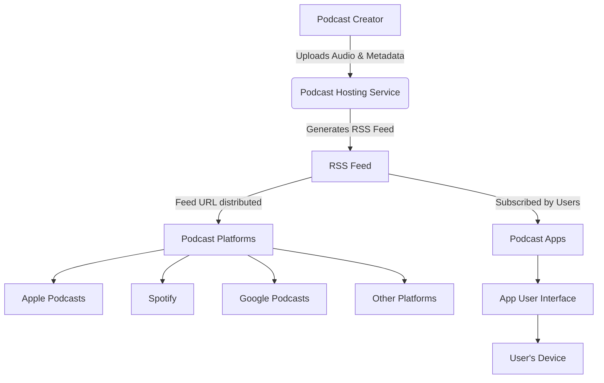

```mermaid
graph TD
    A[Podcast Creator] -->|Uploads Audio & Metadata| B(Podcast Hosting Service)
    B -->|Generates RSS Feed| C[RSS Feed]
    C -->|Feed URL distributed| D[Podcast Platforms]
    D --> E[Apple Podcasts]
    D --> F[Spotify]
    D --> G[Google Podcasts]
    D --> H[Other Platforms]
    C -->|Subscribed by Users| I[Podcast Apps]
    I --> J[App User Interface]
    J --> K[User's Device]
```